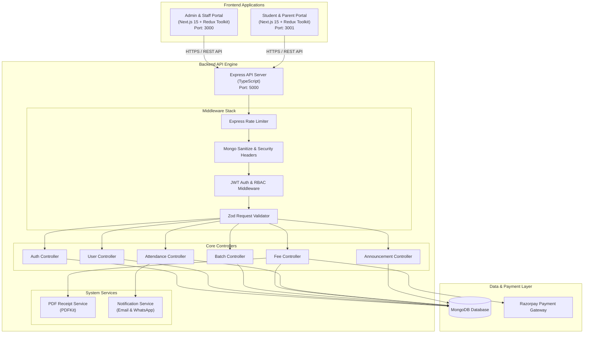
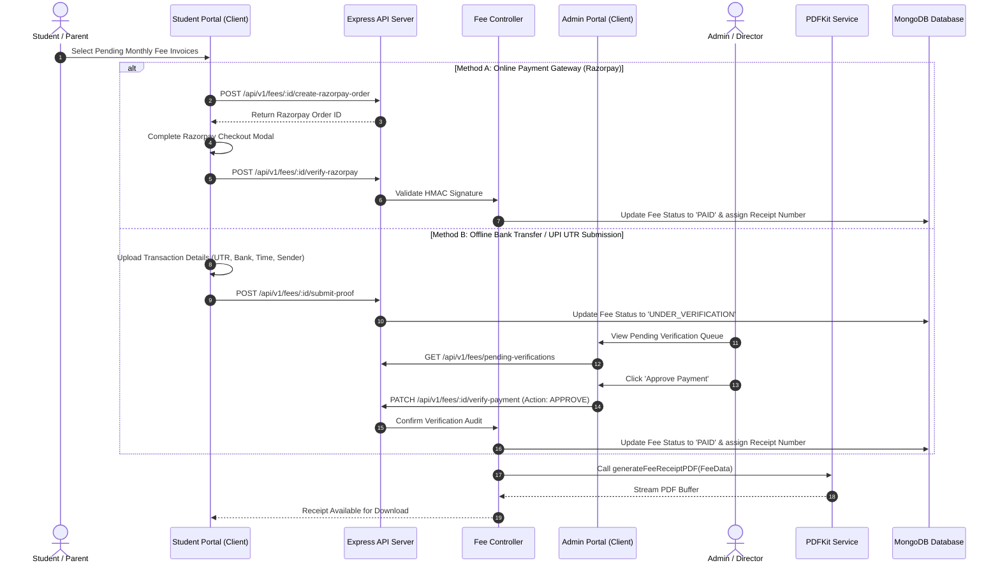
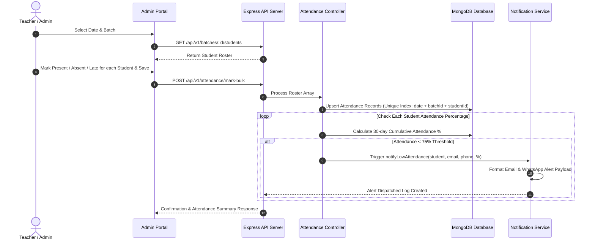
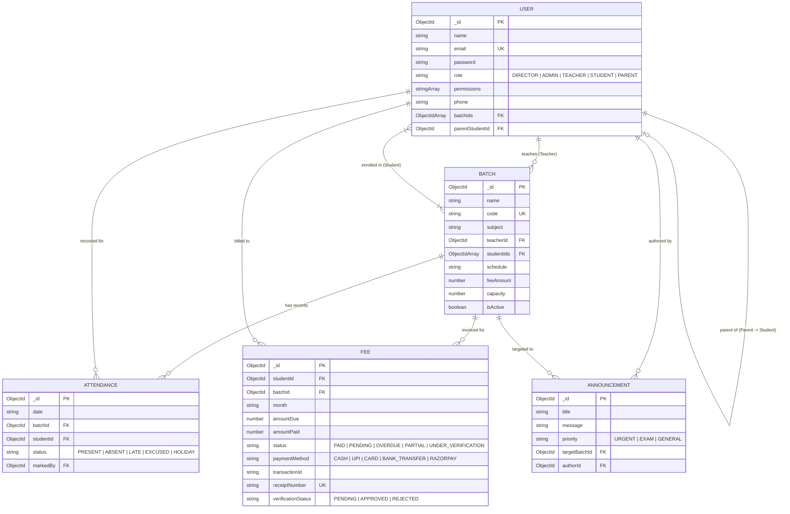

# Apex Class - Enterprise Academy Operations & Tuition Management System

## Executive Overview

Apex Class (Academy Ops) is a production-ready, multi-tenant enterprise tuition and coaching institute management platform. The system is designed using a modern decoupled client-server architecture, featuring separate Next.js web applications for Administrative Operations and Student/Parent Portals, backed by a robust Node.js/TypeScript RESTful API server.

The platform provides end-to-end management capabilities for academic institutions, including student enrollment, teacher assignments, batch scheduling, granular attendance tracking, automated fee invoicing, manual and automated payment verification, instant digital PDF receipt generation, and targeted announcement broadcasting.

---

## High-Level Architecture Overview

The system uses a distributed micro-frontend-inspired client architecture backed by a monolithic backend API engine.



---

## Subsystem Architecture & Technology Stack

### 1. Central Backend Engine (`/server`)

The backend engine is a high-performance Express 5 application written in TypeScript, following a domain-driven Model-Controller-Service pattern with explicit data boundaries.

* **Core Stack**: Node.js, Express 5, TypeScript, Mongoose 8.
* **Security Layer**: Helmet HTTP security header management, CORS origin whitelist engine with dynamic environment verification, Express Mongo Sanitize for NoSQL Injection mitigation, Express Rate Limit for DDoS/Brute-force defense, BcryptJS for salt-hashed credential storage.
* **Authentication**: Dual-token resolution supporting HTTP-Only SameSite cookies and Authorization Bearer headers with JSON Web Tokens (JWT).
* **Validation & Schema Enforcement**: Strict Zod Schema validation middleware on incoming request bodies, query strings, and URL parameters.
* **Document Processing**: PDFKit engine for generating vector-rendered, tamper-evident tuition fee receipts with digital audit trail boxes.
* **Payment Integration**: Native Razorpay API integration for order creation, signature verification, and automated transaction reconciliation.

#### Server Directory Structure

```
server/
├── public/                  # Static landing assets and root entry point
├── src/
│   ├── config/              # Centralized Zod validated environment schema
│   ├── controllers/         # HTTP Controller layer encapsulating business logic
│   ├── middlewares/         # Auth, RBAC, Zod validation, Error handling
│   ├── models/              # Mongoose Object Data Modeling (ODM) schemas
│   ├── routes/              # Modular Express API route definitions
│   ├── services/            # PDF generation & Multi-channel Notification dispatchers
│   ├── utils/               # AppError class, Logger, and helper functions
│   ├── validators/          # Zod validation schema definitions
│   ├── app.ts               # Express application initialization & middleware stack
│   ├── server.ts            # Server entry point & database connection listener
│   └── seed.ts              # Database seeder for demo data & initial setup
├── credentials.json         # Storage for service account keys
├── package.json
└── tsconfig.json
```

---

### 2. Administrative Operations Portal (`/admin`)

The Admin application is an enterprise dashboard designed for directors, administrators, teachers, and operational staff.

* **Core Stack**: Next.js 15 (App Router), React 19, TypeScript, Redux Toolkit, RTK Query, Tailwind CSS, Lucide Icons.
* **State Management**: RTK Query slices providing normalized caching, optimistic updates, automatic cache invalidation, and poll synchronization for critical operational metrics.
* **Key Functional Modules**:
  * **Executive Overview**: Real-time stats on total enrollment, batch capacity, pending fee approvals, monthly revenue, and average attendance.
  * **User Management**: Role-Based access controller to create, update, and manage Students, Parents, Teachers, and Admins. Supports parent-student account linking and batch assignment.
  * **Batch Management**: Batch scheduling, course allocation, teacher mapping, capacity management, and student roster configuration.
  * **Attendance Suite**: Class-wise daily attendance marking interface (Present, Absent, Late, Excused, Holiday) with automated threshold checking.
  * **Fee & Audit Management**: Automated monthly fee generation, manual payment proof (UTR / Bank Transfer) audit & verification workflow, offline cash receipt issuance, and PDF download.
  * **Broadcast Center**: Priority-tagged announcement dispatcher capable of targeted batch messaging or institute-wide distribution.

#### Admin Directory Structure

```
admin/
├── src/
│   ├── app/
│   │   ├── (auth)/          # Authentication routes (Login)
│   │   ├── (dashboard)/     # Main protected dashboard layout & modules
│   │   │   ├── announcements/
│   │   │   ├── attendance/
│   │   │   ├── batches/
│   │   │   ├── fees/
│   │   │   └── users/
│   │   ├── globals.css      # Custom CSS design system
│   │   └── layout.tsx       # Root layout with Redux Provider wrapper
│   ├── components/          # Reusable UI components (Sidebar, Topbar, Modals, Cards)
│   ├── lib/                 # Utility functions & API client configurations
│   ├── redux/               # Redux Store, RTK Query API slices, and state slices
│   └── types/               # TypeScript interface and type declarations
├── package.json
├── tailwind.config.ts
└── tsconfig.json
```

---

### 3. Student & Parent Portal (`/student`)

The Student portal offers an intuitive interface tailored for students and parents to track academic progress and handle fee transactions seamlessly.

* **Core Stack**: Next.js 15 (App Router), React 19, TypeScript, Redux Toolkit, RTK Query, Tailwind CSS.
* **Key Functional Modules**:
  * **Student Dashboard**: Quick access to individual attendance statistics, pending dues, recent announcements, and enrolled batches.
  * **Fee Invoicing & Payment Hub**: Real-time fee status monitoring (Paid, Pending, Overdue, Under Verification). Supports direct online payments via Razorpay Gateway and offline UTR proof submission.
  * **Digital Receipts**: Instant downloadable PDF receipts verified by transaction proof details.
  * **Attendance Analytics**: Detailed subject-wise and date-wise attendance records with percentage calculations against institutional thresholds.
  * **Notice Board**: Categorized announcement feed with filter options by priority (Urgent, Exam, General).

---

## Security & Authorization Architecture

### Role-Based Access Control (RBAC) Matrix

The system implements a rigid permission-based security framework with five primary user roles:

| Feature / Action | DIRECTOR | ADMIN | TEACHER | STUDENT | PARENT |
| :--- | :---: | :---: | :---: | :---: | :---: |
| System Permissions Management | Explicit | Explicit | No | No | No |
| Create / Edit / Delete Users | Full | Allowed | No | No | No |
| Create & Schedule Batches | Full | Allowed | View | View | View |
| Mark Student Attendance | Full | Allowed | Assigned | No | No |
| View Attendance History | Full | Full | Full | Own | Child |
| Manage Invoices & Fees | Full | Allowed | No | No | No |
| Payment Submission (UTR / Razorpay) | Full | Full | No | Own | Child |
| Verify / Approve Manual Payments | Full | Allowed | No | No | No |
| Broadcast Announcements | Full | Allowed | Assigned | View | View |

### Permission Flag System

Users with the `ADMIN` or `TEACHER` roles can be granted dynamic, fine-grained permission flags:
* `MANAGE_PERMISSIONS`: Allows changing permissions of administrative staff.
* `MARK_ATTENDANCE`: Allows logging daily attendance for assigned batches.
* `MANAGE_FEES`: Grants access to approve/reject payment proofs and generate fee invoices.
* `MANAGE_BATCHES`: Grants authority to create and update batch schedules and student rosters.
* `MANAGE_USERS`: Grants access to create student, parent, and teacher user accounts.
* `BROADCAST_ANNOUNCEMENTS`: Grants authority to dispatch institute announcements.

*Note: Users with the `DIRECTOR` role bypass permission checks automatically with root-level access.*

---

## Core System Workflows

### 1. Manual & Automated Payment Verification Flow



---

### 2. Attendance Tracking & Automated Warning Workflow



---

## Data Models & Schema Design



---

## Complete API Route Index

### 1. Authentication Routes (`/api/v1/auth`)

| Method | Endpoint | Access Level | Description |
| :--- | :--- | :--- | :--- |
| `POST` | `/api/v1/auth/login` | Public | Authenticates credentials, sets HTTP-only cookie, returns JWT. |
| `POST` | `/api/v1/auth/logout` | Authenticated | Clears auth cookies and invalidates session token. |
| `GET` | `/api/v1/auth/me` | Authenticated | Returns current authenticated user profile and permissions. |

### 2. User Management Routes (`/api/v1/users`)

| Method | Endpoint | Access Level | Description |
| :--- | :--- | :--- | :--- |
| `GET` | `/api/v1/users` | Admin / Director | Fetch all users with optional role & search filtering. |
| `POST` | `/api/v1/users` | Admin (`MANAGE_USERS`) | Create a new user account (Student, Teacher, Parent, Admin). |
| `GET` | `/api/v1/users/:id` | Admin / Self | Retrieve single user detailed profile. |
| `PUT` | `/api/v1/users/:id` | Admin (`MANAGE_USERS`) | Update user profile, phone, role, or linked batches. |
| `DELETE` | `/api/v1/users/:id` | Director Only | Remove user account from the system. |

### 3. Batch Management Routes (`/api/v1/batches`)

| Method | Endpoint | Access Level | Description |
| :--- | :--- | :--- | :--- |
| `GET` | `/api/v1/batches` | Authenticated | Fetch active batches (Filtered by user role). |
| `POST` | `/api/v1/batches` | Admin (`MANAGE_BATCHES`) | Create a new academic batch schedule. |
| `GET` | `/api/v1/batches/:id` | Authenticated | Get detailed batch schedule, subjects, and roster. |
| `PUT` | `/api/v1/batches/:id` | Admin (`MANAGE_BATCHES`) | Update batch information, schedule, fee, or assigned teacher. |
| `POST` | `/api/v1/batches/:id/students` | Admin (`MANAGE_BATCHES`) | Enroll or remove students in a batch roster. |

### 4. Fee & Accounting Routes (`/api/v1/fees`)

| Method | Endpoint | Access Level | Description |
| :--- | :--- | :--- | :--- |
| `GET` | `/api/v1/fees` | Admin / Self | List fee invoices with pagination and status filters. |
| `POST` | `/api/v1/fees/generate` | Admin (`MANAGE_FEES`) | Bulk generate monthly invoices for all active batches. |
| `POST` | `/api/v1/fees/:id/submit-proof` | Student / Parent | Submit bank transaction UTR/reference proof for verification. |
| `GET` | `/api/v1/fees/pending-verifications` | Admin (`MANAGE_FEES`) | Retrieve queue of fee payments pending manual approval. |
| `PATCH` | `/api/v1/fees/:id/verify-payment` | Admin (`MANAGE_FEES`) | Approve or reject a submitted payment transaction proof. |
| `POST` | `/api/v1/fees/:id/create-razorpay-order` | Student / Parent | Initiate a Razorpay payment order. |
| `POST` | `/api/v1/fees/:id/verify-razorpay` | Student / Parent | Verify Razorpay payment signature & update invoice. |
| `GET` | `/api/v1/fees/:id/receipt` | Authenticated | Stream generated PDF fee payment receipt. |

### 5. Attendance Routes (`/api/v1/attendance`)

| Method | Endpoint | Access Level | Description |
| :--- | :--- | :--- | :--- |
| `POST` | `/api/v1/attendance/mark-bulk` | Staff (`MARK_ATTENDANCE`) | Bulk mark class attendance for a specific batch and date. |
| `GET` | `/api/v1/attendance/batch/:batchId` | Staff / Admin | Get attendance history log for a batch. |
| `GET` | `/api/v1/attendance/student/:studentId` | Authenticated | Fetch individual student attendance records and percentage metrics. |

### 6. Announcement Routes (`/api/v1/announcements`)

| Method | Endpoint | Access Level | Description |
| :--- | :--- | :--- | :--- |
| `GET` | `/api/v1/announcements` | Authenticated | Fetch active announcements relevant to the user role and batch. |
| `POST` | `/api/v1/announcements` | Staff (`BROADCAST_ANNOUNCEMENTS`) | Publish a new institute or batch announcement. |
| `DELETE` | `/api/v1/announcements/:id` | Staff (`BROADCAST_ANNOUNCEMENTS`) | Delete an announcement post. |

---

## Local Development & Installation Setup

### Prerequisites

Ensure the following tools are installed on your workstation:
* **Node.js**: v18.0.0 or higher
* **npm**: v9.0.0 or higher
* **MongoDB**: Local MongoDB instance running on port 27017 or a MongoDB Atlas connection string.

---

### Step 1: Clone Repository & Install Dependencies

```bash
# Clone the repository
git clone https://github.com/your-org/apex_class.git
cd apex_class

# Install backend dependencies
cd server
npm install

# Install Admin portal dependencies
cd ../admin
npm install

# Install Student portal dependencies
cd ../student
npm install
```

---

### Step 2: Configure Environment Variables

#### Backend Environment Configuration (`server/.env`)

Create a `.env` file inside the `server/` directory:

```env
PORT=5000
NODE_ENV=development
MONGO_URI=mongodb://localhost:27017/tuition_management
JWT_SECRET=super_secret_jwt_key_apex_coaching_2026
JWT_EXPIRES_IN=7d

# Institute Metadata
INSTITUTE_NAME=Apex Coaching Institute
INSTITUTE_EMAIL=contact@apexcoaching.com
INSTITUTE_PHONE=+91 98765 43210
INSTITUTE_ADDRESS=Plot 12, Knowledge Park III, Greater Noida, UP, 201310
INSTITUTE_LOGO_URL=/logo.png

# CORS Allowed Origins
STUDENT_PORTAL_URI=http://localhost:3001
ADMIN_PORTAL_URI=http://localhost:3000
CLIENT_URL=http://localhost:3000

# Razorpay Integration Credentials
RAZORPAY_KEY_ID=rzp_test_ApexCoaching2026
RAZORPAY_KEY_SECRET=apex_coaching_razorpay_secret_2026
```

#### Admin Portal Environment Configuration (`admin/.env.local`)

Create a `.env.local` file inside the `admin/` directory:

```env
NEXT_PUBLIC_API_URL=http://localhost:5000/api/v1
```

#### Student Portal Environment Configuration (`student/.env.local`)

Create a `.env.local` file inside the `student/` directory:

```env
NEXT_PUBLIC_API_URL=http://localhost:5000/api/v1
```

---

### Step 3: Seed Initial Database

Populate your database with demo users (Director, Admins, Teachers, Students), batches, and initial invoices:

```bash
cd server
npm run seed
```

---

### Step 4: Launch Development Servers

Start each application service in separate terminal sessions:

```bash
# Terminal 1: Backend API Engine (Port 5000)
cd server
npm run dev

# Terminal 2: Admin Operations Portal (Port 3000)
cd admin
npm run dev

# Terminal 3: Student & Parent Portal (Port 3001)
cd student
npm run dev
```

Access the applications in your browser:
* **Admin Portal**: `http://localhost:3000`
* **Student Portal**: `http://localhost:3001`
* **Backend Health Check**: `http://localhost:5000`

---

## Production Deployment Guidelines

### Build Execution

Compile TypeScript code for production across all three services:

```bash
# Build server backend
cd server
npm run build

# Build admin frontend
cd ../admin
npm run build

# Build student frontend
cd ../student
npm run build
```

### Server Production Launch

Start the compiled Node.js distribution bundle:

```bash
cd server
npm run start
```

For production hosting, it is recommended to manage the backend process using **PM2** or containerize using **Docker** behind a **Nginx** reverse proxy with SSL termination.

---

## Enterprise Quality Standards

* **TypeScript Strict Mode**: Zero `any` casting allowed across backend controllers and frontend API services.
* **Stateless API Design**: Authentication state managed entirely through verified JWT claims and HTTP-Only session cookies.
* **Automated Data Protection**: Input fields sanitized automatically against NoSQL Query Injections and Cross-Site Scripting (XSS).
* **Auditable Financials**: PDF receipts generated with unique alphanumeric receipt numbers and complete UTR audit trails.
